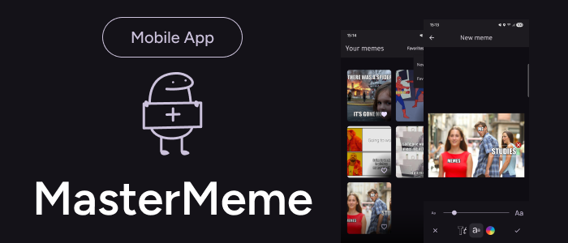
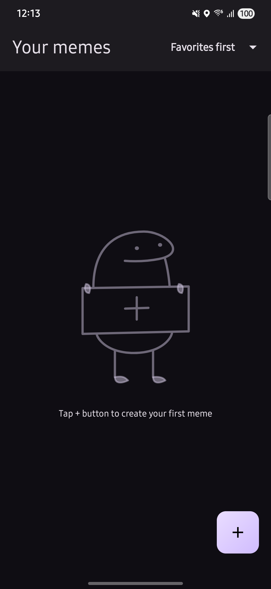
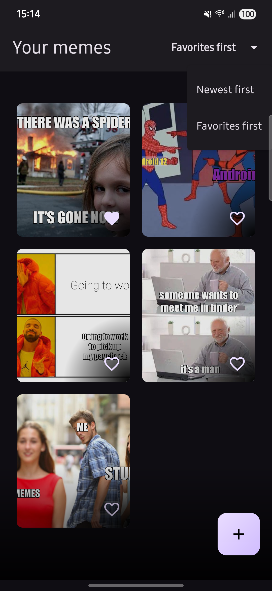
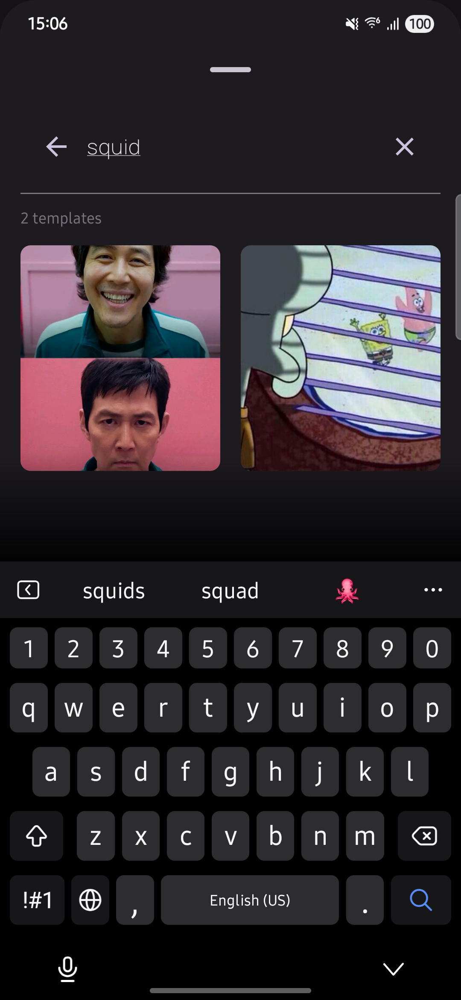
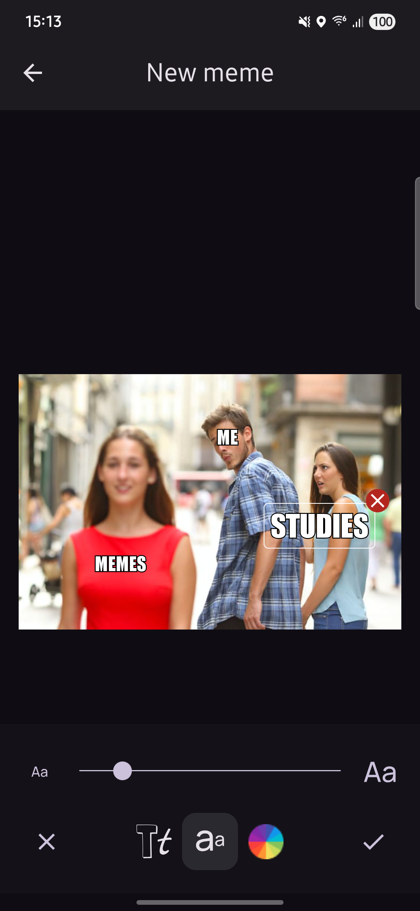

**MasterMeme** is an Android application built for the Mobile Dev Campus by [Phillip Lackner](https://pl-coding.com/campus) as part of the December 2024 monthly challenge. 
This apps allows users to create and share memes. It offers a user-friendly interface to add text to images, manage meme templates, and share your creations with others.

## Project Status

This project was divided into 2 different versions: **MVP** and **Extended**. This is the FINISHED **Extended Version**

### 🚨 Features ###

- **Template Management**: Easily manage and edit meme templates.
- **Create memes**: Add text to images, drag and customize them.
- **Editing Tools**: Undo and redo actions while editing for a seamless experience.
- **Storing**: Store and marks your memes as favorites.
- **Sharing**: Share your memes with friends and on social media.

## 🧑🏽‍💻 Technical implementation ##

- ✅ Jetpack Compose
- ✅ MVI architecture.
- ✅ Hilt dependency injection.
- ✅ Data storage with Room.
- ✅ Material Design 3 components and theming.

## 📱 Screenshots ##

### Your memes ###

|                                                                               |                                                                               | 
|-------------------------------------------------------------------------------|-------------------------------------------------------------------------------|
|  |  |

|                                                                                |                                                                                 | 
|--------------------------------------------------------------------------------|---------------------------------------------------------------------------------|
|  |  |

### New meme ###

|                                                                               |                                                                               | 
|-------------------------------------------------------------------------------|-------------------------------------------------------------------------------|
|  |  |

## 🎥 Demo ##

https://github.com/user-attachments/assets/276f210f-5560-49a6-9f95-8889a5dae282

## Acknowledge

- Mastering Hilt dependency.
- Drag items in screen.
- Bitmap management.

## 🪪 License

This project is an open-source and free to use. Feel free to fork and upload your commits.